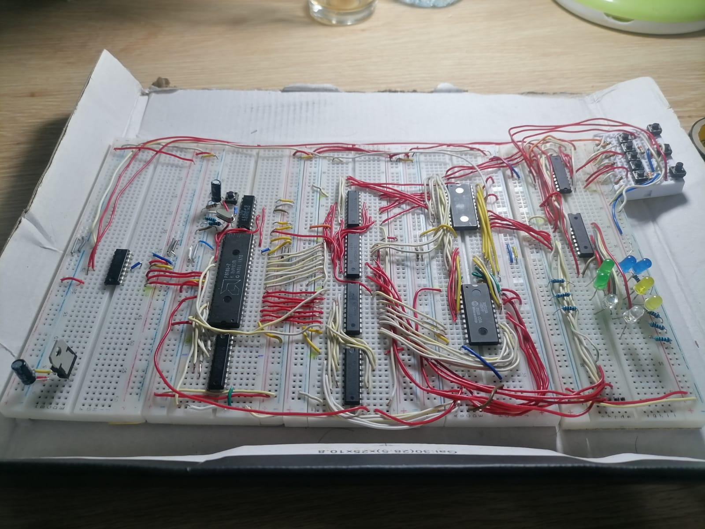

# building a complete Intel 8086-based microcomputer.

- 🔧 Clock Generator: We successfully designed and implemented a clock generator circuit using the 8284 clock generator.

- 🔗 Buffering and Address Scan: We mastered connecting and buffering CPU buses for interfacing, and deepened our understanding of the CPU's principal operation cycles.

- 💾 Memory Interfacing: We connected non-volatile EEPROM memory to execute stored software, gaining essential insights into memory management.

- 🔌 Input/Output Interfacing: We interfaced input and output units with the CPU, allowing interaction with external devices.

These hands-on experiments not only enriched our knowledge of microprocessor architecture and interfacing but also provided practical experience in both hardware and software aspects of embedded systems.

